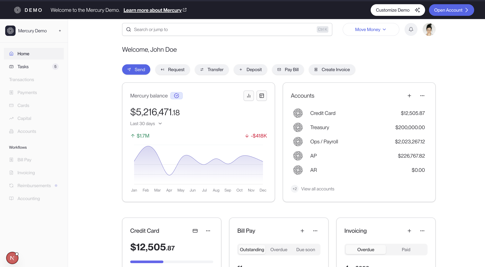

# Mercury Dashboard Clone

## Why this exists

Showcases how we can improve performance for CSR apps utlizing pre-rendering the html at build time for static html.

The og https://demo.mercury.com/dashboard has a few issues related to classic CSR apps:

1. Empty shell appears leading to a huge cumulative layout shift
2. Subsequent navigations is fetching data that's not going to change (i.e. mercury asset/ user profile from cdn)

### Getting started

1. `bun i` (or whatever package manager you use)
2. `bun dev`
